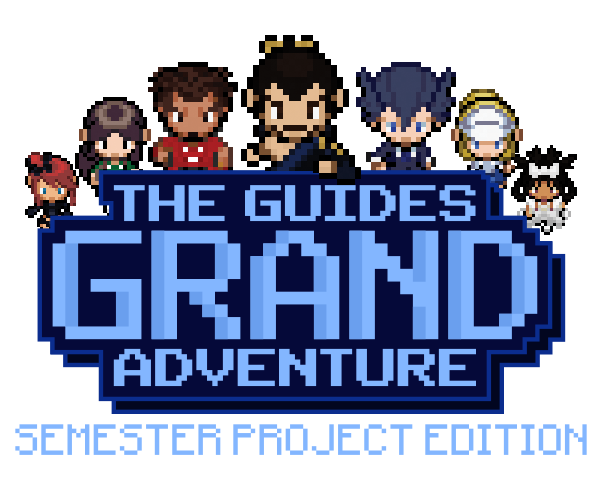

# The Guides Grand Adventure

This is a Repository for Roadrunner Interactive's (Team 11) Application Programming semester project.

 
 

 
 
 

**The Guides Grand Adventure** is a simple android java game inspired by the old 8-bit platform style of games. The project was mainly done in *Android Studio*, with some outside programs such as *Adobe Illustrator* and *Photoshop* used for asset creation and development. The files can easily be imported as an android studio project from this repository, instructions will be listed below. Various assets in the game were sourced from the public, the credits are listed in the credits section.

## Program Examples

 <b>Regular Game Views:</b>
 

 

 
 
  

  
  

<b>Gameplay / Game Engine Example:</b>
 

  

 

## Motivation
 
At the start of the semester we (RR Int.) had a debate on what would motivate us the most to create, and the consensus was a video game! Making games are fun, challenging, and rewarding to create, as well as play, so the decision was a win/win on both fronts. Throughout creating many aspects of the project we learned  valuable lessions about teamwork and java/android programming that will serve us well in future classes and in the carreers we pursue. The game also gave us a chance to demonstrate the creative side of our team, as many of the image files were created by team members, barring some site logos that were included for crediting. In short, this project exists as a demonstration of the lessons we (RR Int.) learned and how we can implement and apply them to a stand-alone android app program.

## Notable Technical Concepts

 Related to CS3443, some important classes and concepts implemented into this game include:
 
**CONTROLLER PACKAGE**

- **CreditsController**:     Controls activity_credits.xml view and shows a list of credits and awknowledgements for the game.

- **GameController**:        Controls activity_game.xml view and implements the game engine, along with the in game menu.

  * createMenuLayout():      Creates the in game menu view by drawing in view elements over the game canvas.

- **GameOverController**:    Controls activity_gameover.xml view and manages file I/O for the high score leaderboard.

  * checkForHighscore():     Checks for additions to the game leaderboard.
  
  * addLeaderboardPopup():   Makes the game leaderboard visible and interactable.
  
  * addUsernamePopup():      Makes the view for adding user information to leaderboard visible and interactable.

- **MainController**:        Controls activity_main.xml and is the primary controller of the program.

- **SettingsController**:    Controls activity_settings.xml view and manages UI's across the program.

**MODEL PACKAGE**

- **CharacterThread**:       The thread that monitors several things including character movement and follower movement.
 
   * run():                  Begins execution of the thread.
 
   * calcInterval():         Calculates the sleep interval for the thread, decreasing the interval as the user score increases.

- **CollectibleThread**:     The thread that monitors collectile item spawning and collectile item collection.
 
   * run():                  Begins execution of the thread.

- **GameCanvas**:            Maintains the game itself, including the paint, character, background, score, soundManger, and various other properties.
 
   * onDraw():               Draws the in game elements which include; controllable character, collectible objects, follower characters, and player score.
 
   * updateCharacters():     Updates the position of the player character and the follower characters.
 
   * updateCollectibles():   Updates the position of the collectible object.
 
   * updateImage():        Updates the sprite images of the current game depending on user selection in settings activity.
 
   * updateBackground():   Updates the background image of the current game depending on user selection in settings activity.
 
   * generateCollectibleCoordinate():     Generates coordinates on the game canvas for the collectible object to be placed at.
 
   * boundaryCollisionCheck():     Checks the player character for collision with the boundaries of the game canvas.
 
   * objectCollisionCheck():    Checks for collisions between two game objects.

- **GameObject**:            Maintains the data associated with the game object, including orientation, charImage, X/Y coords, etc.

- **Leaderboard**:           Maintains an ArrayList of UserRecord objects, basically the highest 5 scores played.
 
   * loadLeaderboard():      Loads the current leaderboard by reading in from a csv file.
 
   * findCharacterImage():   Assigns the correct Bimtap corresponding to a character name.
 
   * saveLeaderboard():      Writes the current working leaderboard to a file.
 
   * getRecord():            Returns the specified UserRecord object.
 
   * removeEndScore():       Pops the last element from the leaderboard when the leaderboard exceeds a limit of 5 entries.

- **MediaPlayerManager**:    Controls music audio through out the program and has a master toggle in the settings.

  * playMusic():           Plays audio file associated with method call.
  
  * toggleSound():         Implements a global on/off for music FX.

- **SoundManager**:          Manages a list of sounds to be used depending on interactions in the GameCanvas.

  * loadSounds():          Loads up the soundpool for use in the program.

  * playSound():           Plays sound file associated with method call.
  
  * setSound():            Implements a global on/off for SFX.

- **UserRecord**:            Creates a record of the game activity that was completed, consisting of a username that the user inputs, a score, and the character used.

 
**ACTIVITY CLASSES**

- **CreditsActivity**:       Credits view, this activity just creates a runnable to give the sprites animation, and has a back button.

  * run():                 Uses a runnable to create a character walking animation.

- **GameActivity**:          Live game component, initializes game objects and sets up the GameCanvas for the user to play the game.

- **GameOverActivity**:      Post game view, shows the user the game score and the top 5 scores leaderboard.

- **MainActivity**:          Main menu component of the program, allows user to access all other views aside from game over through this activity.

  * run():                 Uses a runnable to make the title image sway on its Y axis.

- **SettingsActivity**:      Settings view, gives the user aesthetic and audio options to tailor to their liking.

 
## Installation

You can get the project simply by downloading the code from this repository, this can be done by cloning the repository. After cloning the repository import the project into your android studio by going to File->New->Import Project. Next, wait until the gradle build finishes synchronizing. Once these steps are completed you should be ready to play without any further setup required. (Though setting your android emulator device to a Pixel 6 API 32 is reccomended to get intended performance.)

### Prerequisites

- Have Android Studio
- Create a Virtual Device (Reccomended to get Pixel 6 with API 32)
- In the file dropdown, import the project (after downloading it from this repo).
- Done!

## Contributors

## Acknowledgements

These apply to assets in the game that were sourced from outside creators, huge thanks to them for providing open source assets!

[***Pixabay***](https://pixabay.com/) - Royalty Free Music and Sounds.

[***Freesound***](https://freesound.org/) - Royalty Free Sounds.

[***DaFont***](https://www.dafont.com/) - Fonts and Typefaces for free personal and commercial use. *(Highly reccomend for fellow UI nerds!)*

[***Spriters Resource***](https://www.spriters-resource.com/ds_dsi/pokemonblack2white2/) - Pokemon Black/White 2 Spritesheets.

(Used mainly for inspiration with some of the more basic characters directly used.)

## License

MIT © RR Interactive
